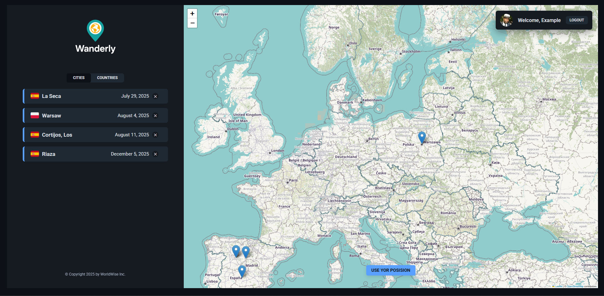
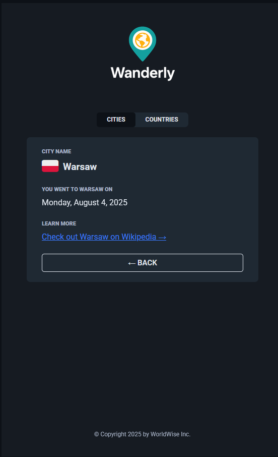
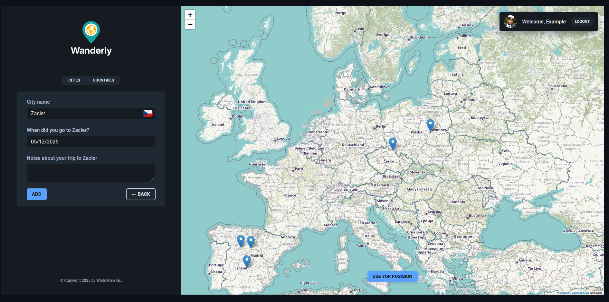

# Wanderly

**Wanderly** is a single-page application (SPA) travel tracker that allows users to mark places they have visited on a world map, store notes, and keep track of their travel dates. Build your personal travel map, track your journey across the globe, and see how your world grows with every new adventure.

Built with the **React** ecosystem and interactive maps.

<div align="center" >

</div>

> [!NOTE]
> This project was created by me while following Jonas Schmedtmann’s “The Ultimate React Course”.

## Table of Contents

- [Screenshots](#screenshots)
- [Technologies](#technologies)
- [Features](#features)
- [Installation & Setup](#installation--setup)
- [Project Structure](#project-structure)
- [API Reference](#api-reference)

---

## Screenshots

### HOMEPAGE


### PRICING


### PRODUCT


### APP LAYOUT



### CITY



### ADD CITY



---

## Technologies

The project uses a modern React stack and Vite development tools.

- **Core:** [React ](https://react.dev/), [Vite](https://vitejs.dev/)
- **Routing:** [React Router Dom ](https://reactrouter.com/) – SPA navigation and nested routes.
- **Maps:** [Leaflet](https://leafletjs.com/) & [React-Leaflet](https://react-leaflet.js.org/) – Map rendering and interaction.
- **State Management:** React Context API + `useReducer` (Global state).
- **Backend (Mock):** `json-server` – REST API simulation on port 8000.
- **Date & Time:** `react-datepicker` and `Intl.DateTimeFormat`.
- **Styling:** CSS Modules for scoped styling.

---

## Features

- **Interactive Map:** Click anywhere on the map to add a new city.
- **Geolocation:** Automatically find your current position to add it to your list.
- **Reverse Geocoding:** Automatically fetches city and country names based on map coordinates.
- **Travel List:** View your visited places as a list of cities or countries.
- **Notes & Dates:** Save specific notes and dates for each trip.
- **Authentication:** Simulated login system (Fake Auth) to protect the main app view.

---

## Installation & Setup

You will need **Node.js** installed on your machine.

1.  **Clone the repository:**

    ```bash
    git clone https://github.com/KucielKrzysztof/Wanderly-visited-places-tracker.git
    cd Wanderly-visited-places-tracker
    ```

2.  **Install dependencies:**

        ```bash
        npm install
        ```

    <!--


3.  **Start the Mock Backend Server:**
    The application requires a backend to fetch city data. Run this in a separate terminal:

    ```bash
    npm run server
    ```

    _This starts `json-server` on port 8000 watching `./data/cities.json`._ -->

4.  **Start the Application:**
    ```bash
    npm run dev
    ```
    Open your browser at the address shown (usually `http://localhost:5173`).

---

## Project Structure

```text
src/
├── components/   # UI Components (Map, Sidebar, Form, CityList, etc.)
├── context/      # Global State (CitiesContext, AuthContext)
├── hooks/        # Custom Hooks (useGeolocation, useUrlPosition)
├── pages/        # Main Pages (Homepage, AppLayout, Login, Product)
├── App.jsx       # Main Router and Provider configuration
└── main.jsx      # Entry point
```

---

## Architecture

### State Management (Context API)

The app uses **Context API** to avoid prop drilling:

- **`AuthProvider`**: Manages user authentication state (`isAuth`, `user`).
- **`CitiesProvider`**: Manages the list of cities, loading states, and API interactions (Create/Delete).
- **`CityProvider`**: Stores details of the currently selected city.

### Routing

Defined in `App.jsx`, utilizing **Lazy Loading** (`Suspense` + `lazy`) for performance:

- **Public Routes:** `/`, `/product`, `/pricing`, `/login`
- **Protected Routes:** `/app` (requires login)
- **Nested Routes:**
  - `/app/cities` – List of cities
  - `/app/cities/:id` – City details
  - `/app/countries` – List of countries
  - `/app/form` – Add new city form

---

## API Reference

The app communicates with a local `json-server` hosted on [Render](https://render.com/).

| Method   | Endpoint      | Description                      |
| :------- | :------------ | :------------------------------- |
| `GET`    | `/cities`     | Fetch all cities                 |
| `GET`    | `/cities/:id` | Fetch details of a specific city |
| `POST`   | `/cities`     | Add a new city                   |
| `DELETE` | `/cities/:id` | Remove a city                    |

**City Object Structure:**

```json
{
	"cityName": "Warsaw",
	"country": "Poland",
	"emoji": "🇵🇱",
	"date": "2027-10-31...",
	"notes": "Capital City of Poland!",
	"position": { "lat": 52.22, "lng": 21.02 },
	"id": 1
}
```

---
